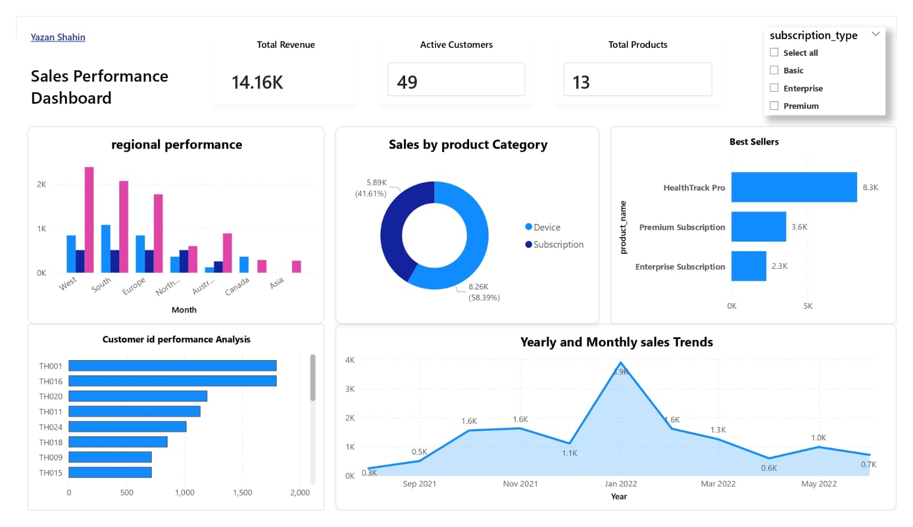
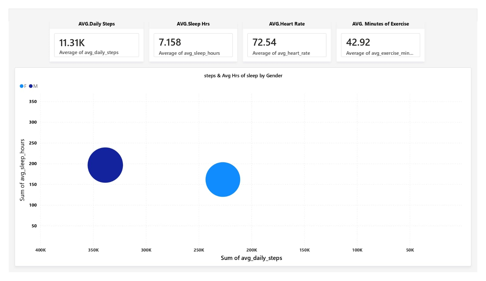

# End-to-End Retail & Health Data Analytics Project

## Project Overview
This project demonstrates a complete data pipeline, from database architectural design and SQL-based ETL processes to advanced data modeling and interactive visualization. By integrating retail sales data with health metrics, the project provides a unified view for business and wellness analysis.

## Visual Dashboard Previews
### 1. Sales Performance Dashboard

Interactive view showing revenue trends, product performance, and sales KPIs.

### 2. Health Metrics Overview

Analysis of user activity, heart rate patterns, and wellness trends.

## Technical Implementation Steps

### 1. Database Setup & Initialization
Defined the core schema and established the foundational tables for the TechHealth and Retail datasets.
* *File:* 01_Database_Setup.sql

### 2. Data Modeling (Star Schema)
Designed a scalable Star Schema to optimize analytical query performance, separating facts from dimensions.
* *File:* 02_Data_Modeling_Star_Schema.sql

### 3. Performance Optimization
Implemented indexing strategies to ensure high-speed retrieval of data even with growing datasets.
* *File:* 03-Query-performance-Indexing.sql

### 4. ETL & Data Transformation
Engineered automated date sequences and data transformation logic to ensure data consistency across the pipeline.
* *File:* 04-Date-Transformation-and-ETL-Process.sql

### 5. Analytical SQL Insights
Developed complex SQL queries to extract actionable KPIs and business insights directly from the data warehouse.
* *File:* 05-Analytical-Insights.sql

## Tools Used
* *SQL Server (T-SQL):* Backend engineering, schema design, and analytical queries.
* *Power BI:* Advanced visualization and interactive reporting.
* *GitHub:* Version control and project documentation.

---
Created by [Yazan](https://github.com/yazan-py)
